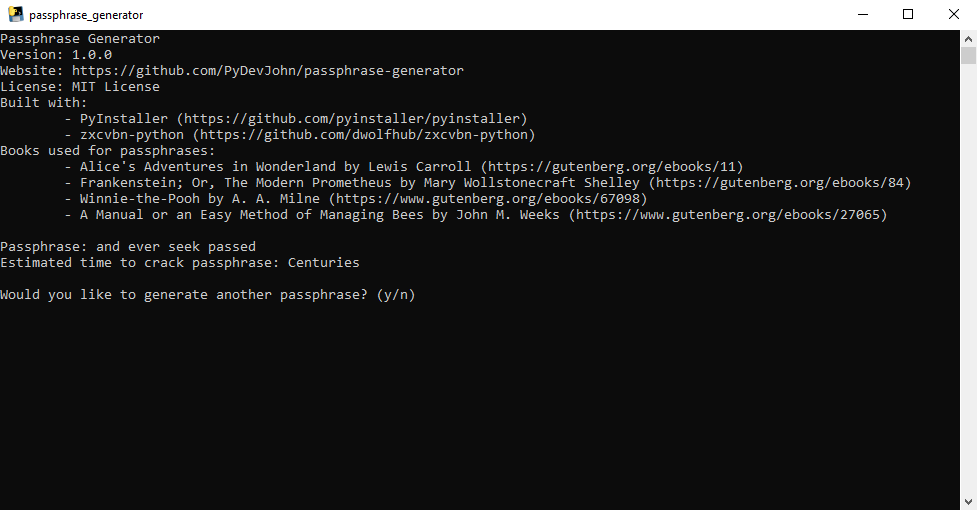

# Passphrase Generator

Creates a random passphrase using books from [Project Gutenberg](https://gutenberg.org).

## Description

*[Another](https://github.com/search?q=XKCD+Password+Generator)* passphrase generator based on [XKCD #936](https://xkcd.com/936). This command line generator, written in Python 3, creates a random passphrase primarily using the Python secrets module and specific books from [Project Gutenberg](https://gutenberg.org), and further generates information on an estimated time to crack the passphrase using [zxcvbn-python](https://github.com/dwolfhub/zxcvbn-python).

Default books used include: 
- [Alice's Adventures in Wonderland by Lewis Carroll](https://gutenberg.org/ebooks/11)
- [Frankenstein; Or, The Modern Prometheus by Mary Wollstonecraft Shelley](https://gutenberg.org/ebooks/84)
- [Winnie-the-Pooh by A. A. Milne](https://www.gutenberg.org/ebooks/67098)
- [A Manual or an Easy Method of Managing Bees by John M. Weeks](https://www.gutenberg.org/ebooks/27065)

Use due diligence with any password generator you use.

## Visuals



## Getting Started

### Dependencies

- The standalone executable has been tested on Microsoft Windows 10.
- The source code has been tested on Microsoft Windows 10 running Python 3.10.6.
- Dependencies required to run the source code consist of [zxcvbn-python](https://github.com/dwolfhub/zxcvbn-python) 4.4.28.

### Installing

- The standalone executable is compressed in a zip folder. Once you unzip the folder, you may run the program by running ```passphrase_generator.exe```. Additionally, you may replace the four default books used, which are located in the ```books``` folder. The book file names must not be changed.

### Executing program

To run the program, open the file ```passphrase_generator.exe```. When the program has opened you will see information about the program, a passphrase, and the estimated time to crack the passphrase. You will also be presented with a yes or no question where you type ```y``` or ```n``` if you would like another passphrase generated. 

## Changelog

See the [CHANGELOG.md](https://github.com/PyDevJohn/passphrase-generator/blob/main/CHANGELOG.md) file for the latest changelog.

## License

- This project is licensed under the MIT License. See the [LICENSE.md](https://github.com/PyDevJohn/passphrase-generator/blob/main/LICENSE) file for further details.

## Acknowledgments

- [PyInstaller](https://github.com/pyinstaller/pyinstaller)
- [zxcvbn-python](https://github.com/dwolfhub/zxcvbn-python)

## Contributing

Contributions are welcomed and appreciated! Please use [GitHub Docs](https://docs.github.com/) for guides on how to use Git, GitHub, and how to contribute. The only two requirements before submitting your code is the [pytest](https://github.com/pytest-dev/pytest) ```tests.py``` file passes its tests, and your code is run through [Black](https://github.com/psf/black).
